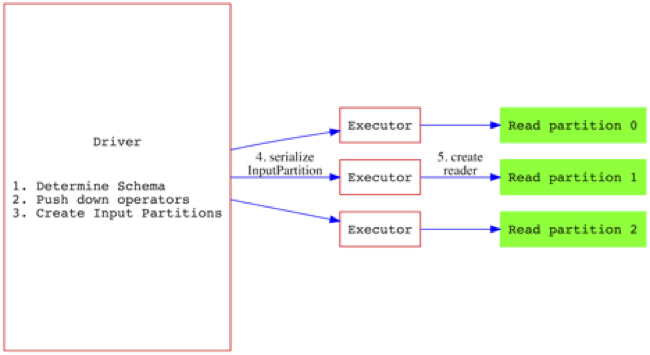
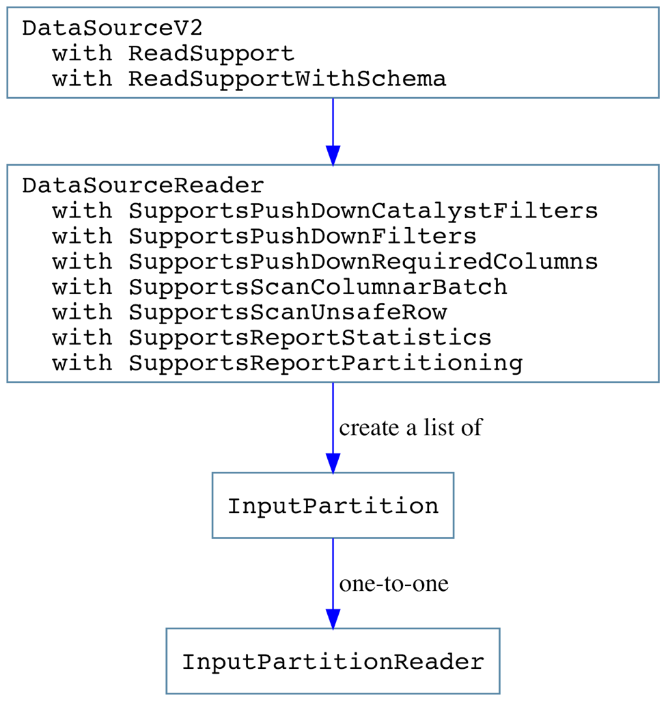

# DataSourceV2 Overview
## 背景与动机

Spark 1.3时期引入的DataSource API(V1)有如下缺陷：
    1. 兼容性问题：由于直接依赖DataFrame/SQLContext为参数，使得其兼容性依赖于这些高阶API
    2. 优化问题：DataSource应该是物理层才暴露在外的接口，其包含的元信息（如分区，排序）等信息，并不能传播给在逻辑层就完成的Optimizing进行执行计划的优化
    3. 不支持谓词下压
    4. 不支持列式读取
    5. 不支持列裁剪
    6. 写接口不支持事务操作

其中，parquet/orc/json等内置格式，并不是基于这个api来开发的，而用的是一套internal并且非public的接口，对于一些外部DataSource的开发人员而言，用起来就比较困难。
    1. 作为一套内部的接口，就不必考虑用户的反应，一旦变化，对于继承它的DataSource就会出现兼容性问题，适配升级spark版本就变得无比困难
    2. 遇上一些sealed的类 或者 private[this]的属性，用反射就实不优雅了


## DataSourceV2覆盖

1. Java友好地
2. 不对公共接口进行依赖，DataFrame/RDD/SparkSession等
3. 支持filter下压
4. 支持列裁剪
5. 在不破坏兼容性的同时，支持后续添加其他算子的下压，比如limit/agg/join等
6. 支持DataSource持有的元信息传递给逻辑计划层处理，比如分区、索引、统计、排序等
7. 同时支持行式及列式的
8. 分离读和写接口，支持单独实现一种
9. 写接口支持事务操作
10. 支持替换HadoopFsRelation
11. 支持替换hive表的读写，hive作为一种DataSource（这个值得后续分析一下）

10和11应该是属于对那套内部接口的的Scan类型进行替换支持，其他属于用户感知的。

## DataSourceV2不覆盖

1. 不支持scala/java之外的语言
2. Write接口的列式output支持，最好有，不止最后有没有
3. 支持Structured Streaming，不在这个JIRA范围之内
4. 不支持update, 只支持现有的的append和overwrite模式
5. 不支持hive metastore之外的外部catalog
6. 不支持拓展ddl语法

## API设计关注点

1. 想实现java友好的api，那就直接用java来写，scala可以很好的接受java, 但java本身并不是很好的接受scala
2. Read接口直接返回结果，而不是RDD, 减少公共接口依赖
3. 类型推导接口
    - 场景1：DataSource实现可设置必须提供schema
    - 场景2：DataSource实现可推导
    - 场景3：首先遵守用户提供的schema, 然后支持自动推导
4. 支持DataSource实现进行schema evolution
5. 列裁剪/PPD/列式读取都单独实现接口，用户可以有选择的几次并实现
6. DataSource的option可支持带有分桶的信息，用于数据的pre-partitioning, 不用单独的接口进行实现，而用参数方式实现
7. 分桶信息支持传播到逻辑层，以避免生成带shuffle的算子
8. Write接口遵循FileFormatWriter/FileCommitProtocol，支持job级别的commit和abort,也就是说api只能保证单job级别的事务性，一旦一个query包含多个job就无法保证了。
9. Read Write Schema推导接口支持Map[String, String]作为option的参数入口，各实现可以想传啥传啥 
10. 上面说的参数CaseInsensitive
11. 上述参数支持session级别的动态设参，spark.datasource.SOURCE_NAME.xxx

## API结构
一共分为四层：

第一层：基类DataSourceV2，指定的source实现必须首先继承这个接口表明身份，再混入其他接口，比如，

```scala
class MyDataSource extends DataSourceV2 with ReadSupport with WriteSupport
``` 
第二层定义：DataSourceReader DataSourceWriter对应该source的操作算子（读或者写），也可以混入PPD等接口或特质，如，

```scala
MyDataSourceReader extend DataSourceReader with SupportsPushdownRequiredColumn with SupportsPushdownFilters

```

第三层：参数：可以序列化和广播到executor端，用以真正执行的reader或writer的实例化

第四层：定义如何对一个partition数据进行操作的逻辑方法

## 读取示意

1. driver端获取schema信息
    - 如果实现[ReadSupportWithSchema](https://github.com/apache/spark/blob/master/sql/core/src/main/java/org/apache/spark/sql/sources/v2/ReadSupportWithSchema.java), 就会使用用户提供的schema信息
    - 如果只是实现了 [ReadSupport](https://github.com/apache/spark/blob/master/sql/core/src/main/java/org/apache/spark/sql/sources/v2/ReadSupport.java)就会进行schema的推导
2. driver端进行谓词下压操作
    - 如果实现[SupportsPushDownFilters](https://github.com/apache/spark/blob/master/sql/core/src/main/java/org/apache/spark/sql/sources/v2/reader/SupportsPushDownFilters.java), 开发人员可以选择[Filters](https://github.com/apache/spark/blob/master/sql/core/src/main/scala/org/apache/spark/sql/sources/filters.scala)进行下压，注意一些下压逻辑需要符合关系代数的逻辑，以免发生结果错误
    - 如果实现[SupportsPushDownCatalystFilters](https://github.com/apache/spark/blob/master/sql/core/src/main/java/org/apache/spark/sql/sources/v2/reader/SupportsPushDownCatalystFilters.java), 支持任意表达式的下压[Expression](https://github.com/apache/spark/blob/master/sql/catalyst/src/main/scala/org/apache/spark/sql/catalyst/expressions/Expression.scala), 这接口目前不稳不可用
    - 如果实现[SupportsPushDownRequiredColumns](https://github.com/apache/spark/blob/master/sql/core/src/main/java/org/apache/spark/sql/sources/v2/reader/SupportsPushDownRequiredColumns.java), 我们的source就可以实现列裁剪了，这应该只对列存有效果吧
3. driver端创建最后[DataSourceReader](https://github.com/apache/spark/blob/master/sql/core/src/main/java/org/apache/spark/sql/sources/v2/reader/DataSourceReader.java)需要真正读取的[InputPartition](https://github.com/apache/spark/blob/master/sql/core/src/main/java/org/apache/spark/sql/sources/v2/reader/InputPartition.java)列表，每个partition刚好对应生成的rdd的partition, 在executor的话，每个InputPartition会实例化一个[InputPartitionReader](https://github.com/apache/spark/blob/master/sql/core/src/main/java/org/apache/spark/sql/sources/v2/reader/InputPartitionReader.java)进行读取。
    - 实现[SupportsScanColumnarBatch](https://github.com/apache/spark/blob/master/sql/core/src/main/java/org/apache/spark/sql/sources/v2/reader/SupportsScanColumnarBatch.java) InputPartition<ColumnarBatch>: 可以列式读取
    - 实现[SupportsScanUnsafeRow](https://github.com/apache/spark/blob/master/sql/core/src/main/java/org/apache/spark/sql/sources/v2/reader/SupportsScanUnsafeRow.java) InputPartition<UnsafeRow>: 支持行式“二进制”的读取
    - InputPartition<Row> : 默认的话会进行行式”row“对象形式的读取
    - 实现[SupportsReportStatistics](https://github.com/apache/spark/blob/master/sql/core/src/main/java/org/apache/spark/sql/sources/v2/reader/SupportsReportStatistics.java) 和[SupportsReportPartitioning](https://github.com/apache/spark/blob/master/sql/core/src/main/java/org/apache/spark/sql/sources/v2/reader/SupportsReportPartitioning.java)，可以让我们在执行阶段有效的使用统计和分区信息
4. driver端对InputPartition列表序列化，传到executor端
5. executor端InputPartition创建InputPartitionReader进行数据的读取

过程抽象如下图，


## 写示意

写的过程的抽象大同小异，有兴趣可以自己去[SPIP: Data Source API V2](https://docs.google.com/document/d/1n_vUVbF4KD3gxTmkNEon5qdQ-Z8qU5Frf6WMQZ6jJVM/edit#heading=h.mi1fbff5f8f9) Dig


## 后记

本文基于范文臣同学的[SPIP: Data Source API V2](https://docs.google.com/document/d/1n_vUVbF4KD3gxTmkNEon5qdQ-Z8qU5Frf6WMQZ6jJVM/edit#heading=h.mi1fbff5f8f9)进行粗鄙的分析，若理解有误请谅解，可以直接参考原文。

PS: 文档属于Proposal，具体在Spark中的实现请直接参考代码。
