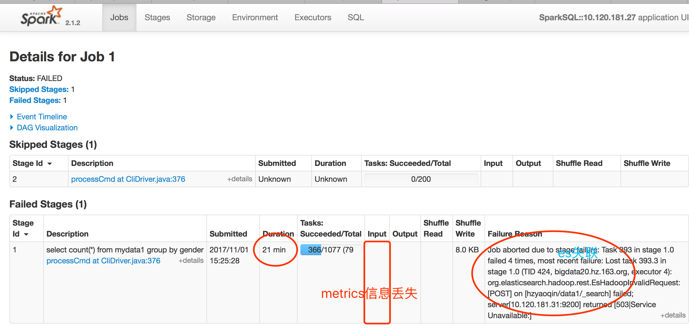

## Prerequisites

## case

```sql
CREATE TEMPORARY view mydata1 using org.elasticsearch.spark.sql options (resource 'hzyaoqin/data1');
select count(*) from mydata1 group by gender;
```

#### 期望：
agg下压至es侧做，得到秒级响应；

#### 实际：
只有where条件等谓词才能下压，spark作为内存计算框架会将es初步过滤的数据，load到spark进行agg操作，这需要高吞吐的支持，个人觉得es的吞吐是个问题（我的es设置基本是默认设置，数据盘设置了12块）。

可以看下执行计划

```
== Parsed Logical Plan ==
Aggregate [gender#10L], [count(1) AS count(1)#51L]
+- SubqueryAlias mydata1
   +- Relation[bslocation#0L,bsyearlevel#1L,constellation#2L,devcompany#3L,devmodel#4L,ebinter#5,eduinter#6,flydays#7L,flytimes#8L,freloc#9L,gender#10L,haschild#11L,idfa#12,imei#13,lalodetail#14,mac#15,mappinter#16,musicinter#17,netactive#18L,nethabit#19L,newsinter#20,proflabel#21L,urs#22,zodiac#23L] ElasticsearchRelation(Map(es.resource -> hzyaoqin/data1),org.apache.spark.sql.SQLContext@33cee31a,None)

== Analyzed Logical Plan ==
count(1): bigint
Aggregate [gender#10L], [count(1) AS count(1)#51L]
+- SubqueryAlias mydata1
   +- Relation[bslocation#0L,bsyearlevel#1L,constellation#2L,devcompany#3L,devmodel#4L,ebinter#5,eduinter#6,flydays#7L,flytimes#8L,freloc#9L,gender#10L,haschild#11L,idfa#12,imei#13,lalodetail#14,mac#15,mappinter#16,musicinter#17,netactive#18L,nethabit#19L,newsinter#20,proflabel#21L,urs#22,zodiac#23L] ElasticsearchRelation(Map(es.resource -> hzyaoqin/data1),org.apache.spark.sql.SQLContext@33cee31a,None)

== Optimized Logical Plan ==
Aggregate [gender#10L], [count(1) AS count(1)#51L]
+- Project [gender#10L]
   +- Relation[bslocation#0L,bsyearlevel#1L,constellation#2L,devcompany#3L,devmodel#4L,ebinter#5,eduinter#6,flydays#7L,flytimes#8L,freloc#9L,gender#10L,haschild#11L,idfa#12,imei#13,lalodetail#14,mac#15,mappinter#16,musicinter#17,netactive#18L,nethabit#19L,newsinter#20,proflabel#21L,urs#22,zodiac#23L] ElasticsearchRelation(Map(es.resource -> hzyaoqin/data1),org.apache.spark.sql.SQLContext@33cee31a,None)

== Physical Plan ==
*HashAggregate(keys=[gender#10L], functions=[count(1)], output=[count(1)#51L])
+- Exchange hashpartitioning(gender#10L, 200)
   +- *HashAggregate(keys=[gender#10L], functions=[partial_count(1)], output=[gender#10L, count#55L])
      +- *Scan ElasticsearchRelation(Map(es.resource -> hzyaoqin/data1),org.apache.spark.sql.SQLContext@33cee31a,None) [gender#10L] ReadSchema: struct<gender:bigint>
```


#### 分析：

```
bin/spark-sql  --num-executors 8 --jars ../elasticsearch-hadoop-5.6.3/dist/elasticsearch-spark-20_2.11-5.6.3.jar
```

```
spark.master=yarn
spark.driver.memory=20g
spark.executor.instances=20
spark.executor.cores=4
spark.executor.memory=20g
spark.executor.extraJavaOptions=-XX:PermSize=1024m -XX:MaxPermSize=1024m -XX:MaxDirectMemorySize=1024m -verbose:gc -XX:+PrintGCDetails -XX:+PrintGCDateStamps -XX:+PrintTenuringDistribution
spark.yarn.executor.memoryOverhead=4096
spark.es.nodes=10.120.181.34,10.120.181.33,10.120.181.32,10.120.181.31
spark.es.port=9200
spark.sql.warehouse.dir            /user/hzyaoqin/warehouse
spark.hadoop.io.compression.codec.lzo.class=org.apache.hadoop.io.compress.DefaultCodec
spark.hadoop.io.compression.codecs=org.apache.hadoop.io.compress.DefaultCodec
spark.serializer                 org.apache.spark.serializer.KryoSerializer
spark.kryoserializer.buffer.max                       256m
spark.network.timeout                                 240s
spark.shuffle.io.maxRetries=30
spark.shuffle.io.retryWait=30s
```

任务失败，es貌似提供不了很高的吞吐，似乎被压爆了

期间bigdata22（10.120.181.33）和bigdata23（10.120.181.34）直接死机了



```scala
17/11/01 15:48:20 WARN TaskSetManager: Lost task 290.0 in stage 1.0 (TID 291, bigdata23.hz.163.org, executor 2): org.elasticsearch.hadoop.rest.EsHadoopNoNodesLeftException: Connection error (check network and/or proxy settings)- all nodes failed; tried [[10.120.181.34:9200, 10.120.181.32:9200, 10.120.181.31:9200]]
    at org.elasticsearch.hadoop.rest.NetworkClient.execute(NetworkClient.java:149)
    at org.elasticsearch.hadoop.rest.RestClient.execute(RestClient.java:461)
    at org.elasticsearch.hadoop.rest.RestClient.execute(RestClient.java:445)
    at org.elasticsearch.hadoop.rest.RestClient.scroll(RestClient.java:520)
    at org.elasticsearch.hadoop.rest.RestRepository.scroll(RestRepository.java:377)
    at org.elasticsearch.hadoop.rest.ScrollQuery.hasNext(ScrollQuery.java:112)
    at org.elasticsearch.spark.rdd.AbstractEsRDDIterator.hasNext(AbstractEsRDDIterator.scala:61)
    at scala.collection.Iterator$$anon$11.hasNext(Iterator.scala:408)
    at org.apache.spark.sql.catalyst.expressions.GeneratedClass$GeneratedIterator.agg_doAggregateWithKeys$(Unknown Source)
    at org.apache.spark.sql.catalyst.expressions.GeneratedClass$GeneratedIterator.processNext(Unknown Source)
    at org.apache.spark.sql.execution.BufferedRowIterator.hasNext(BufferedRowIterator.java:43)
    at org.apache.spark.sql.execution.WholeStageCodegenExec$$anonfun$8$$anon$1.hasNext(WholeStageCodegenExec.scala:377)
    at scala.collection.Iterator$$anon$11.hasNext(Iterator.scala:408)
    at org.apache.spark.shuffle.sort.BypassMergeSortShuffleWriter.write(BypassMergeSortShuffleWriter.java:126)
    at org.apache.spark.scheduler.ShuffleMapTask.runTask(ShuffleMapTask.scala:96)
    at org.apache.spark.scheduler.ShuffleMapTask.runTask(ShuffleMapTask.scala:53)
    at org.apache.spark.scheduler.Task.run(Task.scala:99)
    at org.apache.spark.executor.Executor$TaskRunner.run(Executor.scala:325)
    at java.util.concurrent.ThreadPoolExecutor.runWorker(ThreadPoolExecutor.java:1142)
    at java.util.concurrent.ThreadPoolExecutor$Worker.run(ThreadPoolExecutor.java:617)
    at java.lang.Thread.run(Thread.java:745)
```


## case 2

```
select bslocation from mydata1 limit 100;

select bsyearlevel,bslocation from mydata1 where bslocation=131100 limit 100;

select bsyearlevel,bslocation,constellation,haschild from mydata1 where bslocation=131100 and bsyearlevel=50002 and constellation=50012 and haschild=50038 limit 100;

select bsyearlevel,bslocation,constellation,haschild,flytimes,mac,devmodel,urs from mydata1 where bslocation=131100 and bsyearlevel=50002 and constellation=50012 and haschild=50038 and flytimes=54587 and mac="7@0129221ee1a42c19ca9c76840ae3991b" limit 100;

```

诸如此类的sql执行时间在60s左右，spark测执行过程在1-3s内，基本时间都应该消耗在es喂数据给spark阶段了

## case 3 一个尴尬的sql

```
 select bsyearlevel,bslocation,constellation,haschild,flytimes,mac,devmodel,urs from mydata1 where mac="7@0129221ee1a42c19ca9c76840ae3991b" limit 100;
```

这个sql在es这边mac字段应该是个unique的值吧，spark处理limit 100有点在这种场景下有点坑爹，结果集在为满足100的条件下，spark会起一轮一轮的job来查询es，最后就是全表扫描。。


